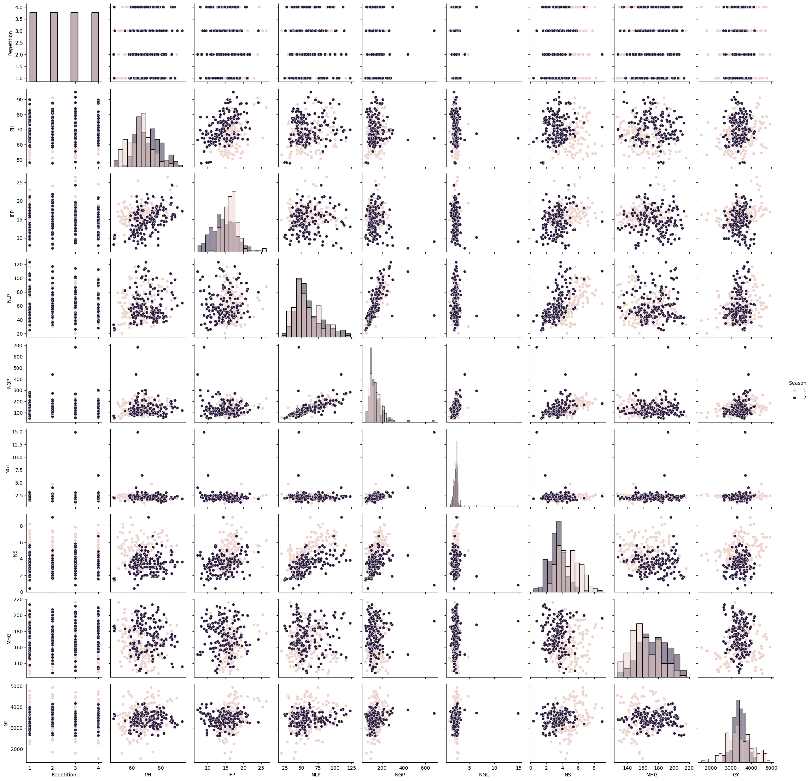
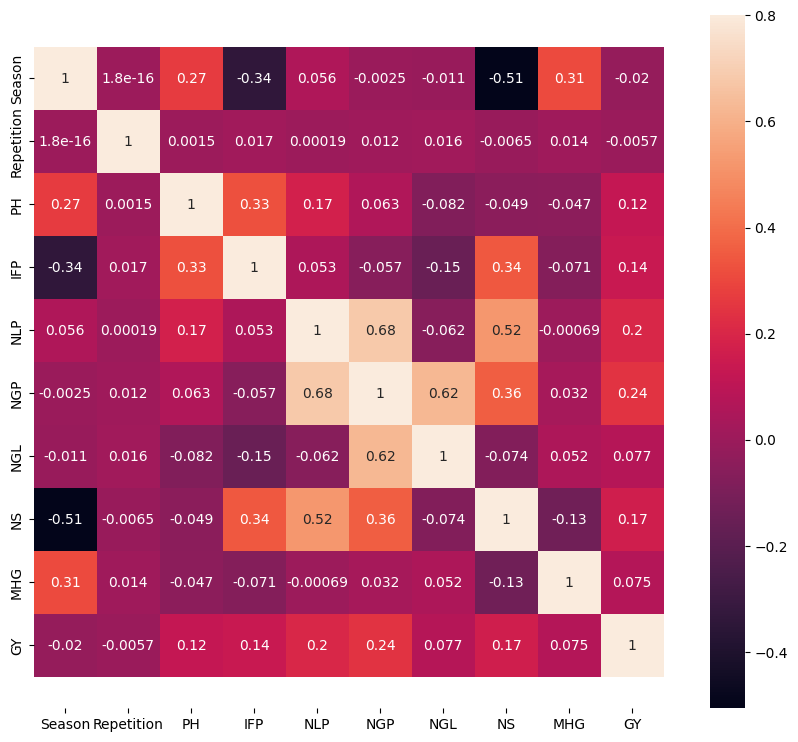
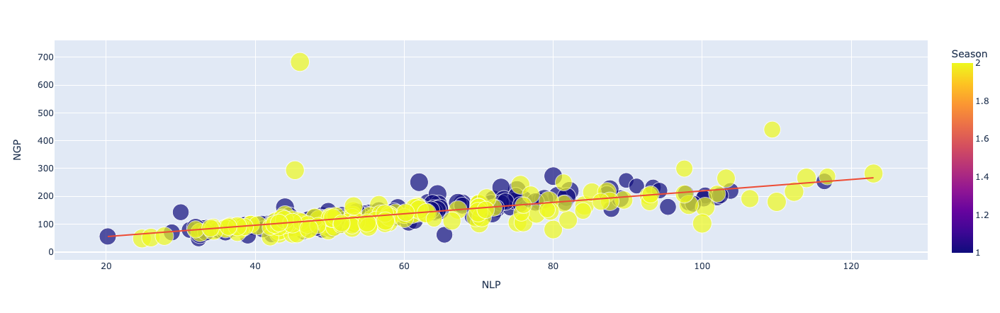
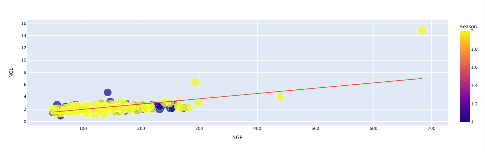
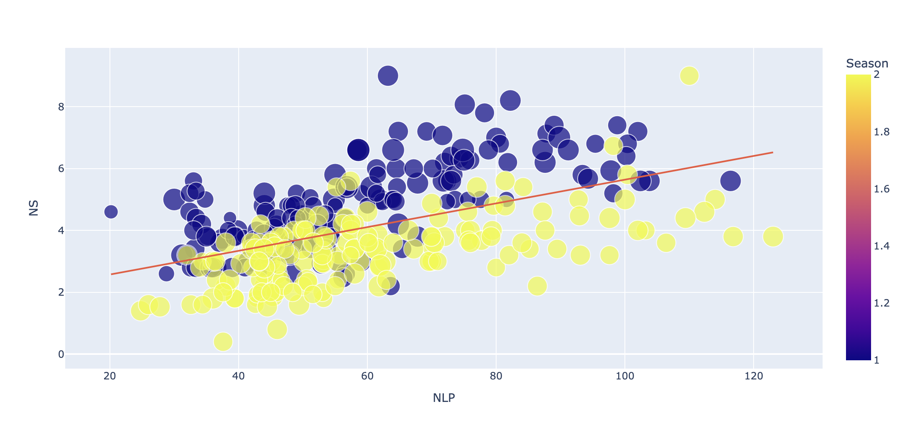
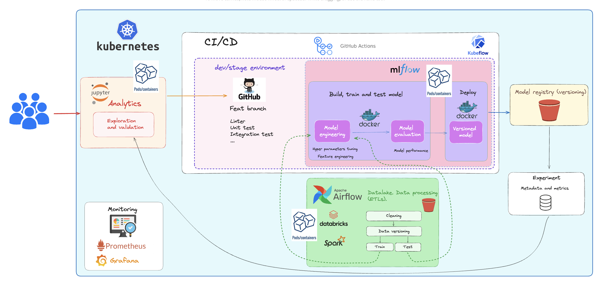
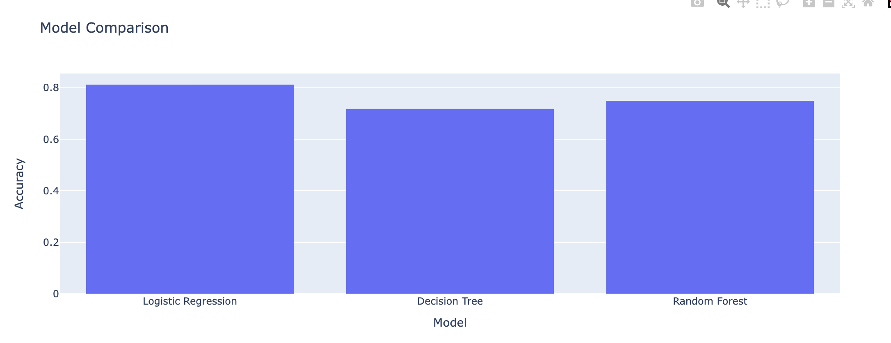

# Capstone project

This project uses the dataset: **Forty soybean cultivars from subsequents harvests**.

It is intended to design a Machine learning model that could help predict the question stated.

## The question

This is a classification problem and we would like to predict what type of cultivar will be better to plant in a specific Season.

## Exploratory Data Analysis

From the dataset we can find the next variables:

|      Name      |Description                    |Type                         |
|----------------|-------------------------------|-----------------------------|
|PH				 |`Plant Height.` It is determined from the soil surface to the insertion of the last leaf using a milimeter ruler. | cm |
|IFP          	 |`Insertion of the first pod.` Determined from the soil surface to the insertion of the firts vegetable.  | cm |
|NS     	     |`Number of stems.` Through manual counting. |unit|
|NLP     	     |`Number of legumes per plant.` Through manual counting. |unit|
|NGP     	     |`Number of grains per plant.` Through manual counting. |unit|
|NGL     	     |`Number of grains per pod.` Through manual counting. |unit|
|MHG     	     |`Thousand seed weight.` According to the methodology described in Brasil. |g|
|GY     	     |`Grain yield.` Determined by harvesting the useful area of the plot and standardized to a grain moisture level of 13%. |kg ha^-1^|

### Target variable

There are different types of target variables:

- Categorical variables. These represent distinct classes or categories. They're often used in classification problems.
- Numerical variables. These can take on continuous values and are usually used in regression problems.
- Ordinal variables. These target variables have a specific order or rank.

This problem tries to solve a classification problem so we need a categorical variable. The main idea is to predict in which season we'll get better harvests.

According to the values shown in the data frame, the target variable could be the "Season" since it could only take the values 1 and 2.

It's also needed to analyze the correlations between variables so we can have a better understanding.

### Analyzing the correlation of the variables

Let's see the correlation between the variables in the next graph. Some of the more meaningful correlations are NLP and NGP, NGP and NGL, and NS and NLP.

Checking the graphs for each corelation we have this:

- NLP and NGP

- NGP and NGL

- NS and NLP

Using NS and NLP would help classify easier to know what season would be better to plant a cultivar.

> NOTE: We are also considering to reduce the overfitting in the model

## Architecture

We need an MLOps strategy so we can automate the model deployments. We would be able to test and simplify every release going through several environments like dev or prod.

At a first glance, this is the proposed architecture:

This architecture mainly involves launching each deployment in Kubernetes by making use of Docker for the containers. For CI/CD (Automation), Github actions would do the magic.

## ML Model

Since we're trying to solve a classification problem and due to complexity, the more suitable models to predict the values with high accuracy would be a decision tree, a logistic regression or a random forest model.

Making a comparison of the models, we are getting a major accuracy with the Logistic Regression model. We would use it to classify the cultivars and decide on which season they should be planted according to the number of steams and legumes.

To check out the operations in details, see this [notebook](/jupyther-notebooks/Final_project.ipynb)

## New Incoming Data

There could be 2 options for this:

- Web scrapping to get more samples
- Create a script to generate values in some given ranges
