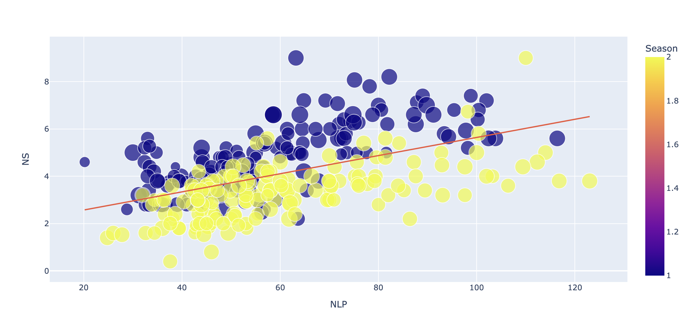

# Capstone project

This project uses the dataset: **Forty soybean cultivars from subsequents harvests**.

It is intended to design a Machine learning model that could help predict the question stated.

## Exploratory Data Analysis

From the dataset we can find the next variables:

|      Name      |Description                    |Type                         |
|----------------|-------------------------------|-----------------------------|
|PH				 |`Plant Height.` It is determined from the soil surface to the insertion of the last leaf using a milimeter ruler. | cm |
|IFP          	 |`Insertion of the first pod.` Determined from the soil surface to the insertion of the firts vegetable.  | cm |
|NS     	     |`Number of stems.` Through manual counting. |unit|
|NLP     	     |`Number of legumes per plant.` Through manual counting. |unit|
|NGP     	     |`Number of grains per plant.` Through manual counting. |unit|
|NGL     	     |`Number of grains per pod.` Through manual counting. |unit|
|MHG     	     |`Thousand seed weight.` According to the methodology described in Brasil. |g|
|GY     	     |`Grain yield.` Determined by harvesting the useful area of the plot and standardized to a grain moisture level of 13%. |kg ha^-1^|

Looking at the Jupyther Notebook we see this correlation table:
|index|Season|Repetition|PH|IFP|NLP|NGP|NGL|NS|MHG|GY|
|---|---|---|---|---|---|---|---|---|---|---|
|Season|1\.0|1\.7253612365068544e-16|0\.2685229145068726|-0\.33779633442245344|0\.05605933383512796|-0\.0024694771152274234|-0\.010543304544320281|-0\.5060155700131117|0\.30791211346323627|-0\.019709891255374975|
|Repetition|1\.7253612365068544e-16|1\.0|0\.0014547015588298184|0\.016846945229170605|0\.0001939015678923124|0\.011717388846098232|0\.015944733006950613|-0\.0064645449014103145|0\.013688085587982273|-0\.005696532835483628|
|PH|0\.2685229145068726|0\.0014547015588298184|1\.0|0\.3253700201055861|0\.17273732335476566|0\.06347393868943486|-0\.08196139777615023|-0\.04873400138619883|-0\.046618237181773624|0\.1232807303872044|
|IFP|-0\.33779633442245344|0\.016846945229170605|0\.3253700201055861|1\.0|0\.053085142215856904|-0\.05742272135711596|-0\.15159816317828526|0\.3443601702954744|-0\.07112278985848994|0\.13909000030098423|
|NLP|0\.05605933383512796|0\.0001939015678923124|0\.17273732335476566|0\.053085142215856904|1\.0|0\.6817944245527734|-0\.06212191770270324|0\.5219033113551365|-0\.0006872335682949132|0\.19874121397465258|
|NGP|-0\.0024694771152274234|0\.011717388846098232|0\.06347393868943486|-0\.05742272135711596|0\.6817944245527734|1\.0|0\.6215072540790607|0\.35969747132262364|0\.032085414402360235|0\.23888349558719305|
|NGL|-0\.010543304544320281|0\.015944733006950613|-0\.08196139777615023|-0\.15159816317828526|-0\.06212191770270324|0\.6215072540790607|1\.0|-0\.0735672100492012|0\.05160352154561627|0\.07740352649706983|
|NS|-0\.5060155700131117|-0\.0064645449014103145|-0\.04873400138619883|0\.3443601702954744|0\.5219033113551365|0\.35969747132262364|-0\.0735672100492012|1\.0|-0\.12925170894888688|0\.16702199226244205|
|MHG|0\.30791211346323627|0\.013688085587982273|-0\.046618237181773624|-0\.07112278985848994|-0\.0006872335682949132|0\.032085414402360235|0\.05160352154561627|-0\.12925170894888688|1\.0|0\.0745515631744213|
|GY|-0\.019709891255374975|-0\.005696532835483628|0\.1232807303872044|0\.13909000030098423|0\.19874121397465258|0\.23888349558719305|0\.07740352649706983|0\.16702199226244205|0\.0745515631744213|1\.0|

## Solving the question

We would like to predict what type of cultivar will be better to plant in a specific Season.

To solve it, we will consider the number of steams and number of legumes per plant.

## Analyzing the correlation of the variables graphically

From this diagram we see a pattern that might help us predict which season would be better to plant a cultivar:

	> We are also considering to reduce the overfitting in the model

Making a comparison of the models, we are getting a major accuracy with the Logistic Regression model. We would use that model to classify the cultivars and decide on which season they should be planted according to the number of steams and legumes.

To check out the operations in details, see this [notebook](/jupyther-notebooks/Final_project.ipynb)
